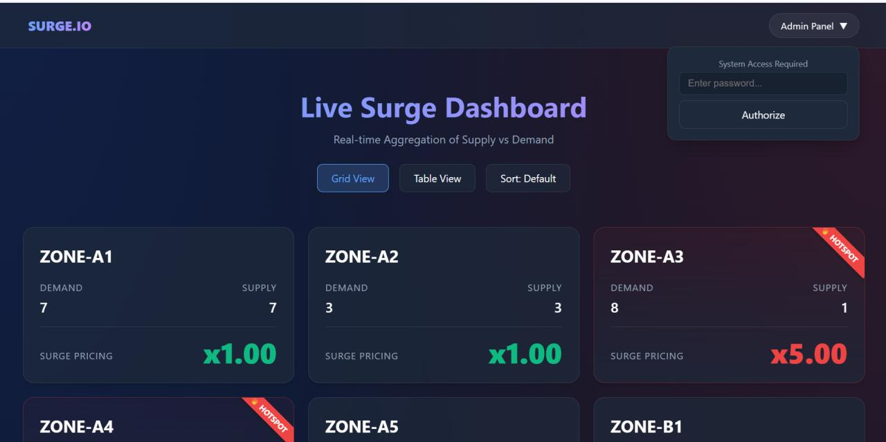
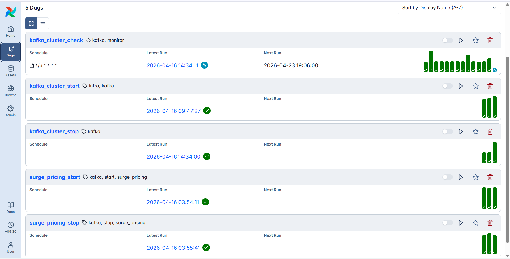

# Real-Time Ride-Sharing Surge Pricing Pipeline



This project simulates a real-time ride-sharing data pipeline that calculates surge pricing multipliers for different geographic zones based on supply (driver availability) and demand (ride requests). 

The architecture is highly decoupled and designed for **horizontal scaling**, making it ideal for deployment across multiple Google Cloud Platform (GCP) Virtual Machines (VMs) or containerized environments (like GKE or Cloud Run).

## 🏗️ Architecture Overview


The system consists of the following isolated components:
1. **Kafka Cluster:** Acts as the message broker. Receives raw event data.
2. **Data Generator (`pyspark/data_generator.py`):** Simulates thousands of real-time ride requests and driver pings, publishing them to Kafka.
3. **PySpark Streaming Job (`pyspark/surge.py`):** Consumes the Kafka stream, aggregates supply and demand over a 5-minute tumbling window, calculates the surge multiplier, and pushes the state to a Google Cloud Storage (GCS) Bucket.
4. **Webserver (`Webserver/server.py`):** A frontend UI that reads the aggregated JSON state directly from the GCS bucket and displays a live dashboard.
5. **Airflow Orchestration (`airflow-control/`):** Manages and schedules the jobs, triggering scripts on remote VMs via SSH.

   

---

## 🚀 Deployment Guide (GCP VMs)

To deploy this horizontally, we recommend provisioning **4 separate Compute Engine VMs** on GCP. 
- `vm-kafka` (e2-medium)
- `vm-spark` (e2-standard-2)
- `vm-airflow` (e2-medium)
- `vm-webserver` (e2-micro)

### Step 1: Infrastructure Setup (Terraform)
First, create the required Google Cloud Storage Bucket to hold the streaming results.
1. Navigate to `pyspark/bucket_terraform/`.
2. Edit the `terraform.tfvars` file and replace the placeholders:
   ```hcl
   project_id            = "your-gcp-project-id"
   region                = "us-central1"
   bucket_name           = "your-unique-surge-bucket-name"
   service_account_email = "your-service-account@..."
   ```
3. Run Terraform to deploy:
   ```bash
   terraform init
   terraform apply
   ```

### Step 2: Environment Variables (`.env`)
Across your VMs, you will need to provide configurations. Create a `.env` file (or export these variables to your bash profile) on the relevant VMs:
```bash
ADMIN_PASSWORD=your_secure_password
KAFKA_BOOTSTRAP_SERVERS_PUBLIC=PUBLIC_IP_OF_KAFKA_VM:9092
KAFKA_BOOTSTRAP_SERVERS_INTERNAL=INTERNAL_IP_OF_KAFKA_VM:9092
GCS_BUCKET=your-unique-surge-bucket-name
GCP_PROJECT_ID=your-gcp-project-id
```

### Step 3: Component Deployments

Since we have Dockerized the components, deploying them on their respective VMs is straightforward. Ensure Docker is installed on all VMs.

#### 1. Kafka Broker (`vm-kafka`)
- Copy the `kafka/` folder to `vm-kafka`.
- Run the provided startup scripts (e.g., `./start-cluster.sh` or `./start-kafka.sh`) to initialize the Kafka broker and create the `topic1` topic.

#### 2. Airflow Orchestrator (`vm-airflow`)
- Copy the `airflow-control/` folder to `vm-airflow`.
- Build the Airflow Docker image:
  ```bash
  cd airflow-control
  docker build -t surge-airflow .
  ```
- Make sure to place the proper SSH private key in `airflow-control/dags/.ssh_key_kafka` so Airflow can trigger scripts on other VMs.
- Run the container and access the Airflow UI on port `8080`.

#### 3. PySpark & Data Generator (`vm-spark`)
- Copy the `pyspark/` folder to `vm-spark` (or submit it to a Dataproc cluster).
- Build the Spark Docker image:
  ```bash
  cd pyspark
  docker build -t surge-pyspark .
  ```
- **Run the Generator:**
  ```bash
  docker run -e KAFKA_BOOTSTRAP_SERVERS_INTERNAL=INTERNAL_IP_OF_KAFKA_VM:9092 surge-pyspark python data_generator.py --bootstrap-servers INTERNAL_IP_OF_KAFKA_VM:9092
  ```
- **Run the Streaming Job:**
  You must ensure the VM has Application Default Credentials (ADC) configured for GCP access, or map a Service Account JSON file.
  ```bash
  docker run -e GCS_BUCKET=your-unique-surge-bucket-name -e GCP_PROJECT_ID=your-gcp-project-id surge-pyspark python surge.py --bootstrap-servers INTERNAL_IP_OF_KAFKA_VM:9092
  ```

#### 4. Web Dashboard (`vm-webserver`)
- Copy the `Webserver/` folder to `vm-webserver`.
- Build the webserver Docker image:
  ```bash
  cd Webserver
  docker build -t surge-webserver .
  ```
- Run the webserver:
  ```bash
  # Ensure the container has permissions to read from GCS
  docker run -p 8000:8000 -e GCS_BUCKET=your-unique-surge-bucket-name -e GCP_PROJECT_ID=your-gcp-project-id -e ADMIN_PASSWORD=your_secure_password surge-webserver
  ```
- **Access the Dashboard:** Open your browser to `http://PUBLIC_IP_OF_WEBSERVER:8000`.

---

## ⚙️ How it Works & Where to Edit

- **Tuning Data Volume:** If you want to simulate more rides, edit the arguments passed to `data_generator.py` (e.g., `--rate` and `--duration`).
- **Modifying Surge Logic:** The actual math behind the surge multipliers happens in `pyspark/surge.py` inside the PySpark `when()` logic.
- **Clearing Dashboard State:** On the Webserver UI, click "Admin Panel" in the navbar, enter your `ADMIN_PASSWORD`, and click "Clear Live Data". This safely truncates the JSON file in GCS.
- **Airflow SSH Keys:** Airflow triggers remote scripts via SSH. Ensure `dags/.ssh_key_kafka` contains the valid private key to access your `vm-kafka` and `vm-spark` instances, and verify the IPs mapped in your Airflow variables.

---

## 🌟 Why Use Self-Hosted VMs for this Pipeline?

While you *could* use fully managed services (like Confluent Cloud for Kafka or GCP Dataproc for Spark), deploying this pipeline on self-hosted VMs offers several distinct advantages:

1. **Cost Efficiency:** Managed data services often charge a premium per-GB or per-job. By self-hosting on standard Compute Engine VMs, you pay only for raw compute and memory. For high-throughput, continuous streaming (like ride-sharing data), this drastically reduces your cloud bill.
2. **Absolute Control & Tuning:** You get full OS-level access. This allows you to optimize kernel parameters for Kafka's network I/O or deeply customize the JVM settings for PySpark without hitting arbitrary platform restrictions.
3. **Zero Vendor Lock-in:** Because everything runs in standard Docker containers on vanilla Linux VMs, this entire pipeline can be lifted and shifted to AWS EC2, Azure VMs, or even an on-premise data center with virtually zero code changes.
4. **Strict Security & VPC Isolation:** You can place the Kafka broker, Airflow orchestrator, and Spark job inside a strict private subnet with zero public internet access. They communicate securely over internal IP addresses, and only the Webserver exposes port 8000 to the outside world. 
5. **No Serverless Limitations:** Real-time continuous streaming often hits execution timeouts or API rate limits on serverless platforms (like Cloud Run or Cloud Functions). Dedicated VMs run 24/7 without interruption, ensuring your surge multipliers are always live.
